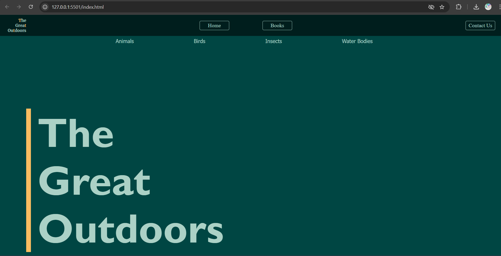
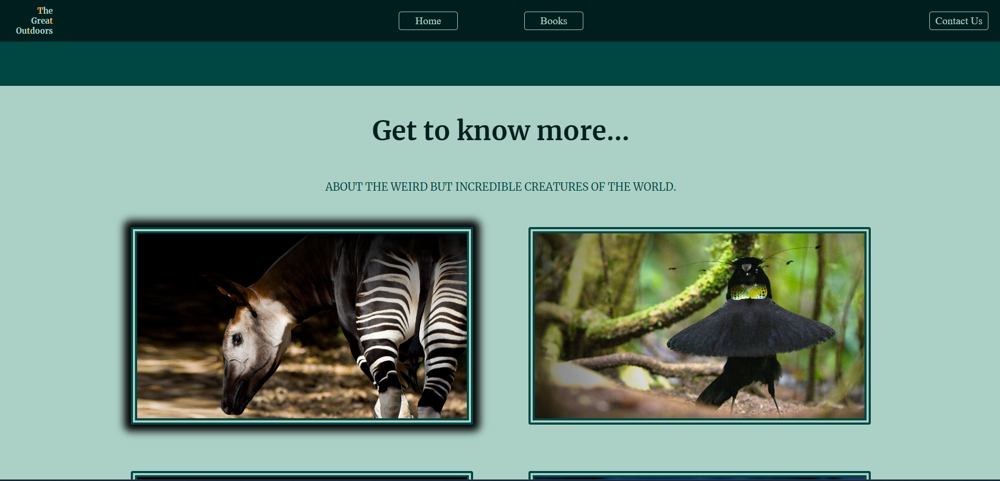
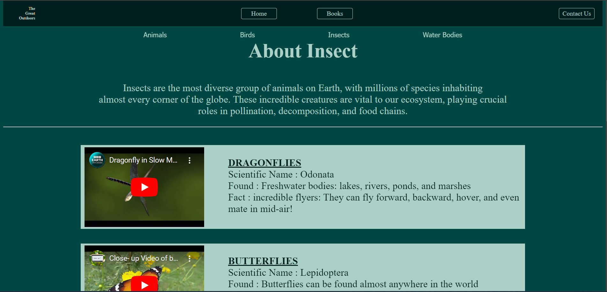
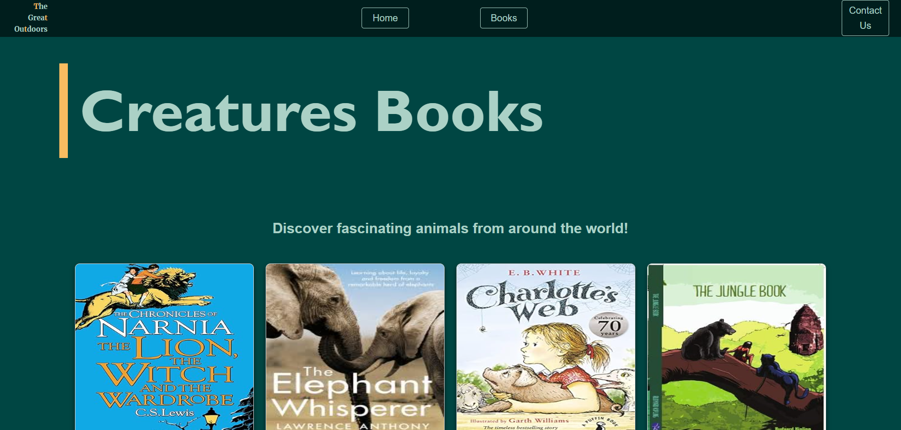

# The Great Outdoors
## Project Overview 
Welcome to The Great Outdoors

The Great Outdoors is an interactive and informative website that delves into the wonders of the natural world. The project consists of seven engaging pages: Home, Book, Animals, Birds, Insects, Water Bodies, and Contact Us.
 Each page showcases unique images of various species, accompanied by informative cards highlighting fascinating facts and characteristics. The website boasts a consistent design language, featuring a header, footer, and favicon, ensuring a seamless user experience.
  By exploring "The Great Outdoors," visitors can embark on a virtual journey to discover and learn about the diverse range of animals, birds, insects, and water bodies that inhabit our planet.

  

 
## Objectives
Plan to achieve by the end of project.

- To create an interactive and informative website about the natural world.
- To showcase diverse species of animals, birds, insects, and water bodies.
- To provide unique images and informative cards highlighting fascinating facts and characteristics.
- To design a user-friendly interface with a consistent design language.
- To educate visitors about the natural world and its wonders.
- To provide a virtual platform for exploration and discovery.
- To promote awareness and appreciation for the natural world.
- To create a seamless user experience through easy navigation and clear information presentation.

 

## Information Sections

Animals: Explore detailed profiles of mammals, reptiles, amphibians, and more. Learn about their habitats, behaviors, and unique characteristics.

Birds: Discover a wide range of avian species. Our bird section covers everything from common backyard species to rare and exotic birds.

Insects: Dive into the world of insects, including butterflies, beetles, ants, and spiders. Find information on their life cycles, roles in the ecosystem, and interesting facts.

Water Bodies: Understand the importance of various water bodies, including rivers, lakes, and oceans. Learn how they support life and their role in the environment.

## Books Available

Our project offers a comprehensive online platform for book lovers, providing a vast collection of books for purchase and home delivery. Users can browse and buy books from our extensive catalog and even opt for home delivery. Our platform aims to make reading accessible and enjoyable, bridging the gap between readers and books. With a user-friendly interface and seamless navigation, users can easily discover new titles, authors, and making our platform a one-stop destination for all book-related needs.

[ Visit to website ]https://thegreatoutdoorss.netlify.app